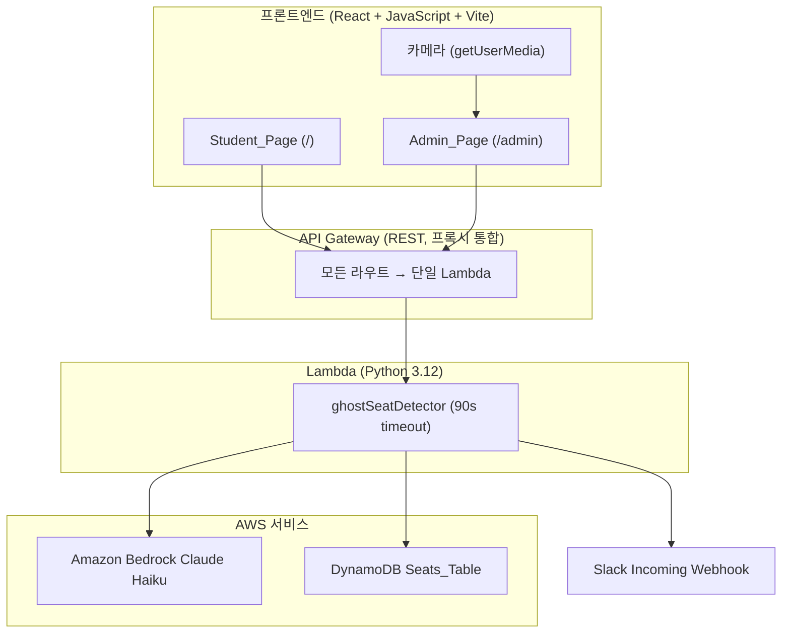
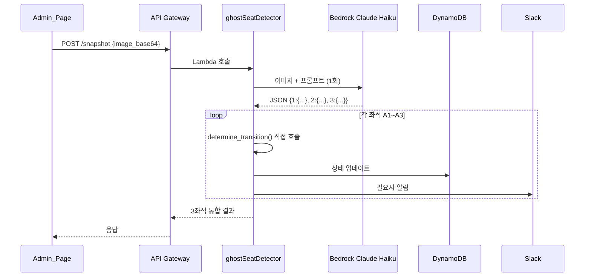
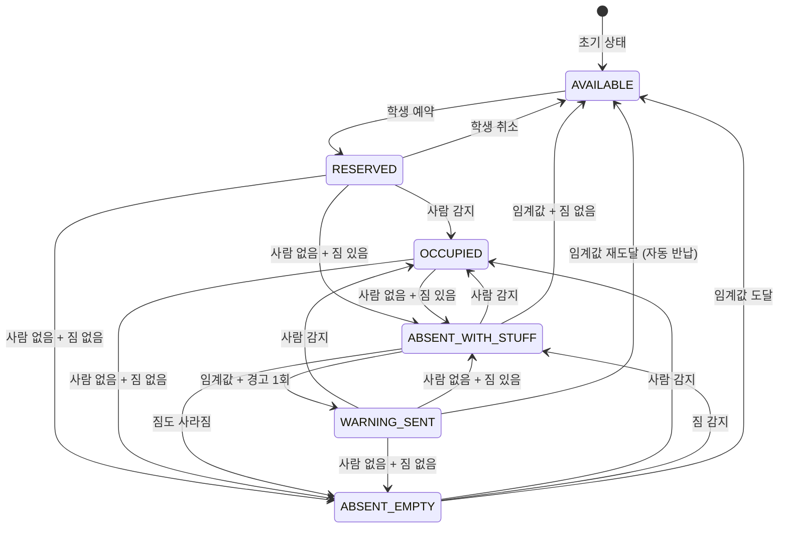

# 기술 설계서: 도서관 좌석 유령 예약 감지 시스템 (Ghost Seat Detector)

## Overview

도서관 좌석 유령 예약 감지 시스템은 카메라 1대로 번호표(1, 2, 3)가 부착된 3개 좌석을 동시에 촬영하고, Amazon Bedrock Claude Haiku를 통해 각 좌석의 점유 상태를 AI로 분석하여 유령 예약을 자동 감지·경고·반납 처리하는 시스템이다.

핵심 설계 결정:
- Lambda 1개 통합 — HTTP method + path 기반 내부 라우팅 (AWS 콘솔 세팅 간소화)
- 카메라 1대 → Bedrock 1회 호출로 3좌석 동시 분석 (비용 효율)
- 번호표 기반 좌석 식별
- "앉아있는 자세"만 사람 감지로 인정
- base64 직접 전송 (S3 미사용)
- DynamoDB Single Table Design, GSI 없음
- 인증 없음 (학번+이름 단순 입력)
- 1인 1좌석 검증 없음 (단순 예약)

## Architecture

### 시스템 아키텍처



### 스냅샷 분석 흐름



### 좌석 상태 전이




## Components and Interfaces

### 1. Student_Page (React 컴포넌트, JavaScript)

**책임:** 학생 로그인, 좌석 현황 조회, 예약/취소, 경고 표시

**동작:**
- 5초 폴링으로 `GET /seats` 호출하여 좌석 현황 갱신
- 상태별 색상: AVAILABLE(초록), RESERVED(노랑), OCCUPIED(파랑), ABSENT_*/WARNING_SENT(주황), AUTO_RETURNED(빨강)
- 본인 좌석에 경고 발생 시 상단 빨간 배너 표시

### 2. Admin_Page (React 컴포넌트, JavaScript)

**책임:** 좌석 대시보드, 카메라 모니터링, 이벤트 로그 표시

**동작:**
- 카메라 시작/중지 버튼
- `getUserMedia` API로 카메라 접근 → 설정 간격으로 자동 스냅샷 촬영
- 스냅샷을 base64로 인코딩하여 `POST /snapshot` 전송
- 5초 폴링으로 좌석 현황 + 이벤트 로그 갱신

### 3. ghostSeatDetector (통합 Lambda, Python 3.12)

**책임:** 모든 백엔드 로직 — 좌석 조회, 예약/취소, 스냅샷 분석, 상태 전이, Slack 알림

**라우팅 구조:**
```python
def lambda_handler(event, context):
    method = event['httpMethod']
    path = event['path']
    
    if method == 'GET' and path == '/seats':
        return handle_get_seats()
    elif method == 'GET' and '/seats/' in path:
        return handle_get_seat(seat_id)
    elif method == 'GET' and path == '/events':
        return handle_get_events(limit)
    elif method == 'POST' and path.endswith('/reserve'):
        return handle_reserve(seat_id, body)
    elif method == 'POST' and path.endswith('/cancel'):
        return handle_cancel(seat_id, body)
    elif method == 'POST' and path == '/snapshot':
        return handle_snapshot(body)
    elif method == 'OPTIONS':
        return cors_response()
```

**스냅샷 분석 핵심 로직 (handle_snapshot 내부):**
1. base64 이미지 디코딩 (data URI prefix 제거)
2. Bedrock Claude Haiku에 이미지 + 프롬프트 전송 (1회)
3. JSON 응답 파싱
4. 번호표→좌석 매핑: `LABEL_TO_SEAT = {"1": "A1", "2": "A2", "3": "A3"}`
5. 각 좌석에 대해 `determine_transition()` 직접 호출
6. DynamoDB 업데이트 + Slack 알림 + 이벤트 로그
7. 3좌석 결과 통합 응답

**설정:** 타임아웃 90초, Bedrock 모델 `anthropic.claude-3-haiku-20240307-v1:0`, Bedrock 타임아웃 30초

**상태 전이 로직:**

```python
def determine_transition(current_status, person_detected, stuff_detected, 
                          absence_count, warning_count, threshold):
    if current_status == "AVAILABLE":
        if person_detected or stuff_detected:
            return {"action": "NOTIFY_UNAUTHORIZED", "new_status": "AVAILABLE"}
        return {"action": "IGNORE", "new_status": "AVAILABLE"}
    
    if person_detected:
        return {"action": "SET_OCCUPIED", "new_status": "OCCUPIED", "absence_count": 0}
    
    new_absence = absence_count + 1
    if new_absence < threshold:
        new_status = "ABSENT_WITH_STUFF" if stuff_detected else "ABSENT_EMPTY"
        return {"action": "INCREMENT_ABSENCE", "new_status": new_status, "absence_count": new_absence}
    
    if not stuff_detected:
        return {"action": "AUTO_RETURN", "new_status": "AVAILABLE"}
    
    if warning_count == 0:
        return {"action": "SEND_WARNING", "new_status": "WARNING_SENT", "warning_count": 1, "absence_count": 0}
    else:
        return {"action": "AUTO_RETURN_WITH_ADMIN", "new_status": "AVAILABLE"}
```

**Slack 알림:**
- 학생 경고: `⚠️ 좌석 {seat_id}에서 장시간 이탈이 감지되었습니다. 복귀해주세요.`
- 관리자 호출: `🚨 좌석 {seat_id} 경고 2회 누적. 자동 반납 처리됨.`
- 무단 점유: `👀 좌석 {seat_id}(미예약)에서 사람/짐이 감지되었습니다.`
- urllib.request 사용, 실패 시 로그만 기록

## Data Models

### DynamoDB Seats_Table

**테이블명:** `ghost-seat-detector-seats` (GSI 없음)

| 속성명 | 타입 | 설명 |
|--------|------|------|
| PK | String (Partition Key) | `SEAT#A1`, `EVENT#A1` |
| SK | String (Sort Key) | `METADATA`, ISO 8601 타임스탬프 |
| seat_id, seat_label, status, student_id, student_name | String | 좌석 정보 |
| absence_count, warning_count | Number | 카운터 |
| has_stuff | Boolean | 짐 존재 여부 |
| updated_at | String | ISO 8601 |
| event_type, event_detail | String | 이벤트 로그용 |
| ttl | Number | 이벤트 자동 삭제 |

### 접근 패턴

| 패턴 | 연산 | PK | SK |
|------|------|----|----|
| 개별 좌석 | GetItem | `SEAT#A1` | `METADATA` |
| 전체 좌석 | BatchGetItem | `SEAT#A1`~`A3` | `METADATA` |
| 상태 업데이트 | UpdateItem | `SEAT#A1` | `METADATA` |
| 이벤트 저장 | PutItem | `EVENT#A1` | 타임스탬프 |
| 이벤트 조회 | Query × 3 | `EVENT#A1`~`A3` | SK 역순 |

### 초기 데이터

```json
[
  {"PK": "SEAT#A1", "SK": "METADATA", "seat_id": "A1", "seat_label": "1", "status": "AVAILABLE", "student_id": "", "student_name": "", "absence_count": 0, "warning_count": 0, "has_stuff": false},
  {"PK": "SEAT#A2", "SK": "METADATA", "seat_id": "A2", "seat_label": "2", "status": "AVAILABLE", "student_id": "", "student_name": "", "absence_count": 0, "warning_count": 0, "has_stuff": false},
  {"PK": "SEAT#A3", "SK": "METADATA", "seat_id": "A3", "seat_label": "3", "status": "AVAILABLE", "student_id": "", "student_name": "", "absence_count": 0, "warning_count": 0, "has_stuff": false}
]
```

### API 요청/응답

#### POST /snapshot
```json
// 요청
{"image_base64": "data:image/jpeg;base64,..."}
// 응답 200
{
  "A1": {"person_detected": true, "stuff_detected": false, "status": "OCCUPIED", "absence_count": 0, "warning_count": 0},
  "A2": {"person_detected": false, "stuff_detected": true, "status": "ABSENT_WITH_STUFF", "absence_count": 3, "warning_count": 0},
  "A3": {"person_detected": false, "stuff_detected": false, "status": "AVAILABLE", "absence_count": 0, "warning_count": 0}
}
```

#### POST /seats/{seat_id}/reserve
```json
{"student_id": "20241234", "student_name": "홍길동"}
```

#### POST /seats/{seat_id}/cancel
```json
{"student_id": "20241234"}
```

## Error Handling

| 오류 상황 | 처리 방식 |
|-----------|-----------|
| Bedrock 타임아웃/파싱 실패 | 에러 로그, 500 응답 |
| Bedrock 응답 번호표 키 누락 | 누락 좌석만 건너뜀 |
| DynamoDB 읽기/쓰기 실패 | 에러 로그, 500 응답 |
| Slack Webhook 실패 | 에러 로그, 좌석 상태 변경 정상 진행 |
| 개별 좌석 상태 전이 실패 | 해당 좌석만 건너뜀 |
| 이미 예약된 좌석 | 409 Conflict |
| 타인 좌석 취소 | 403 Forbidden |
| 존재하지 않는 좌석 | 404 Not Found |
| 프론트엔드 API 실패 | 에러 메시지, 다음 폴링 재시도 |
| 카메라 접근 거부 | 권한 요청 안내 |
